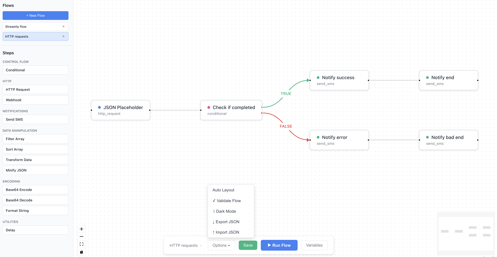

# Streamly

[](https://github.com/magomzr/streamly/actions/workflows/ci.yml)



Streamly is a workflow automation engine with a visual UI, built with NestJS and TypeScript.

## Project Structure

```
streamly/
├── api/          # NestJS backend (workflow engine)
├── web/          # React frontend (visual flow builder)
└── shared/       # Shared types, schemas, and metadata
```

## Getting Started

### Prerequisites

- Node.js 18+
- pnpm 8+

### Installation

```bash
# Install all dependencies
pnpm install
```

### Development

```bash
# Run API in development mode
pnpm dev:api

# Run both API and Web (when web is ready)
pnpm dev

# Run tests
pnpm test

# Build all packages
pnpm build
```

## Packages

### API (`/api`)

The workflow automation engine. See [api/README.md](./api/README.md) for detailed documentation.

**Quick start:**

```bash
cd api
pnpm dev
```

API runs on `http://localhost:3000`

### Web (`/web`)

Visual flow builder UI with React and ReactFlow.

**Quick start:**

```bash
cd web
pnpm dev
```

Web runs on `http://localhost:5173`

### Shared (`/shared`)

Shared types, schemas, and metadata used by both API and Web. See [shared/README.md](./shared/README.md) for details.

## Adding a New Step

To add a new step that works in both API and Web:

### 1. Update Shared Package (`/shared`)

**Add step type** in `shared/src/types/flow.ts`:

```typescript
export type StepType =
  | 'http_request'
  | 'your_new_step'  // Add here
  | ...;
```

**Add schema** in `shared/src/schemas/step-schemas.ts`:

```typescript
export const STEP_SCHEMAS: Record<StepType, FieldSchema[]> = {
  your_new_step: [
    { name: 'fieldName', label: 'Field Label', type: 'text', required: true },
    // Define all configuration fields
  ],
  // ...
};
```

**Add label** in `shared/src/metadata/step-labels.ts`:

```typescript
export const STEP_LABELS: Record<StepType, string> = {
  your_new_step: 'Your New Step',
  // ...
};
```

**Add to category** in `shared/src/metadata/step-categories.ts`:

```typescript
export const STEP_CATEGORIES = {
  utilities: ['delay', 'your_new_step'] as const,
  // ...
};
```

### 2. Implement in API (`/api`)

**Create step service** in `api/src/steps/{category}/your-new-step/`:

```typescript
import { Injectable } from '@nestjs/common';
import { IContext, IStepExecutor } from '../../../types';
import { createStepLog } from '../../../utils/logger';

@Injectable()
export class YourNewStep implements IStepExecutor {
  static readonly stepType = 'your_new_step';

  async run(ctx: IContext, settings: any): Promise<any> {
    const { fieldName } = settings;

    ctx.logs.push(createStepLog('INFO', YourNewStep.name, 'Executing step'));

    // Your implementation here
    return { result: 'success' };
  }
}
```

**Register in module** `api/src/modules/steps.module.ts`:

```typescript
import { YourNewStep } from '../steps/{category}/your-new-step/your-new-step.service';

@Module({
  providers: [..., YourNewStep],
  exports: [..., YourNewStep],
})
export class StepsModule implements OnModuleInit {
  onModuleInit() {
    // ...
    this.engineService.registerStep(YourNewStep);
  }
}
```

**Export from category index** `api/src/steps/{category}/index.ts`:

```typescript
export { YourNewStep } from './your-new-step/your-new-step.service';
```

### 3. That's it!

The Web UI will automatically:

- Show the step in the sidebar
- Display the correct label and category
- Generate the configuration form from the schema
- Send the correct data structure to the API

No changes needed in the Web package!

## Testing Your New Step

```bash
# Test API
cd api
pnpm test

# Test in Web UI
cd web
pnpm dev
# Drag your new step from the sidebar and configure it
```

## Scripts

- `pnpm dev:api` - Start API in watch mode
- `pnpm dev:web` - Start web app in dev mode
- `pnpm dev` - Start both API and web
- `pnpm build` - Build all packages
- `pnpm test` - Run all tests
- `pnpm lint` - Lint all packages
- `pnpm format` - Format code with Prettier

## Documentation

- [API Documentation](./api/README.md)
- [Shared Package](./shared/README.md)
- [Web Documentation](./web/README.md)
- [Cron Triggers - Scheduled Execution](./documentation/CRON_TRIGGERS.md)
- [Architecture](./documentation/)
- [Roadmap and TODO](./documentation/TODO.md)

## License

MIT
